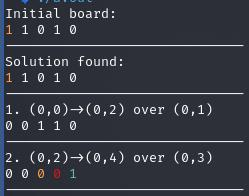
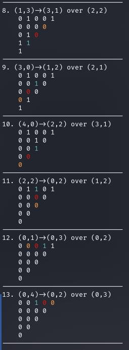
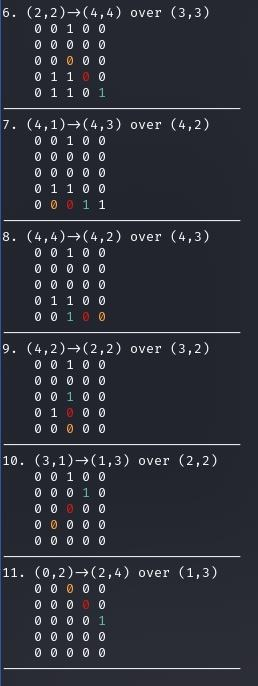

<!--Badger-->
# Peg Solitaire Solver

This program is designed to solve the Peg Solitaire puzzle using various board configurations. It includes a specific 5-row triangle board, but you can also choose from other predefined boards or even load custom boards from files.
> NOTE: CANNOT YET LOAD CUSTOM BOARDS FROM FILES, BUT YOU CAN MAKE A CUSTOM BOARD IN `main.cpp`.





## Cracker Barrel's Peg Solitaire

Cracker Barrel is a popular American restaurant chain known for its wooden triangle Peg Solitaire game that is often found on the tables. The game consists of a triangular board with pegs, and the goal is to jump pegs over each other, removing them until only one peg remains in the center hole. It's a classic puzzle game that patrons can enjoy while waiting for their food.

## Board Configurations

To use the program, you can choose from different predefined boards or load custom boards from files. Here's an example of a predefined 5-row triangle board:

<details>

<summary>Board Types</summary>

> By default, the triangle board is chosen, as shown below:
```cpp
/*// Simple
const int BOARD_SIZE = 1;
const char* initialBoard[BOARD_SIZE] = {
	"11010"
};*/
// Triangle(used in Cracker Barrel)
const int BOARD_SIZE = 5;
const char* initialBoard[BOARD_SIZE] = {
	"11111",
	"1111",
	"111",
	"11",
	"0"
};
/*// Diamond
const int BOARD_SIZE = 5;
const char* initialBoard[BOARD_SIZE] = {
	"00100",
	"01110",
	"11011",
	"01110",
	"00100"
};*/
```

</details>

You can uncomment this board configuration in the code to use it, and there are other boards provided in the code as well.

## Algorithm Efficiency

The program utilizes a graph traversal and path searching algorithm, specifically bidirectional breadth-first IDA* (BFIDA*), to solve the Peg Solitaire puzzle. This approach aims to find an efficient solution by exploring the puzzle space in both directions from the initial state.
> NOTE: THE PROGRAM DOES NOT CURRENTLY SUPPORT `BFIDA*`; IT USES A MORE BRUTE-FORCE APPROACH.

## To-Do List

- [ ] Clean up the codebase for better readability and maintainability.
- [ ] Optimize the solving algorithm for faster results.
- [ ] Implement a function to take in a filename and interpret a custom board from a file to set as the initial board. This feature will allow you to create and solve custom Peg Solitaire boards easily.

```cpp
// NOTE: ATTEMPT TO MAKE ALGORITHM MORE EFFICIENT BY USING BIDIRECTIONAL BREADTH-FIRST IDA(ITERATIVE DEEPENING A*)* (BFIDA*) GRAPH TRAVERSAL AND PATH SEARCHING ALGORITHM

// TODO: CLEANUP
// TODO: OPTIMIZE
// TODO: FUNC. TO TAKE IN FILENAME AND INTERPRET BOARD MADE IN FILE AND RETURN ARRAY FOR `initialBoard`
	// NOTE: FILENAME WOULD BE PASSED IN AS CMD. ARG.
```

Feel free to contribute to the project or use it to challenge yourself with Peg Solitaire puzzles!